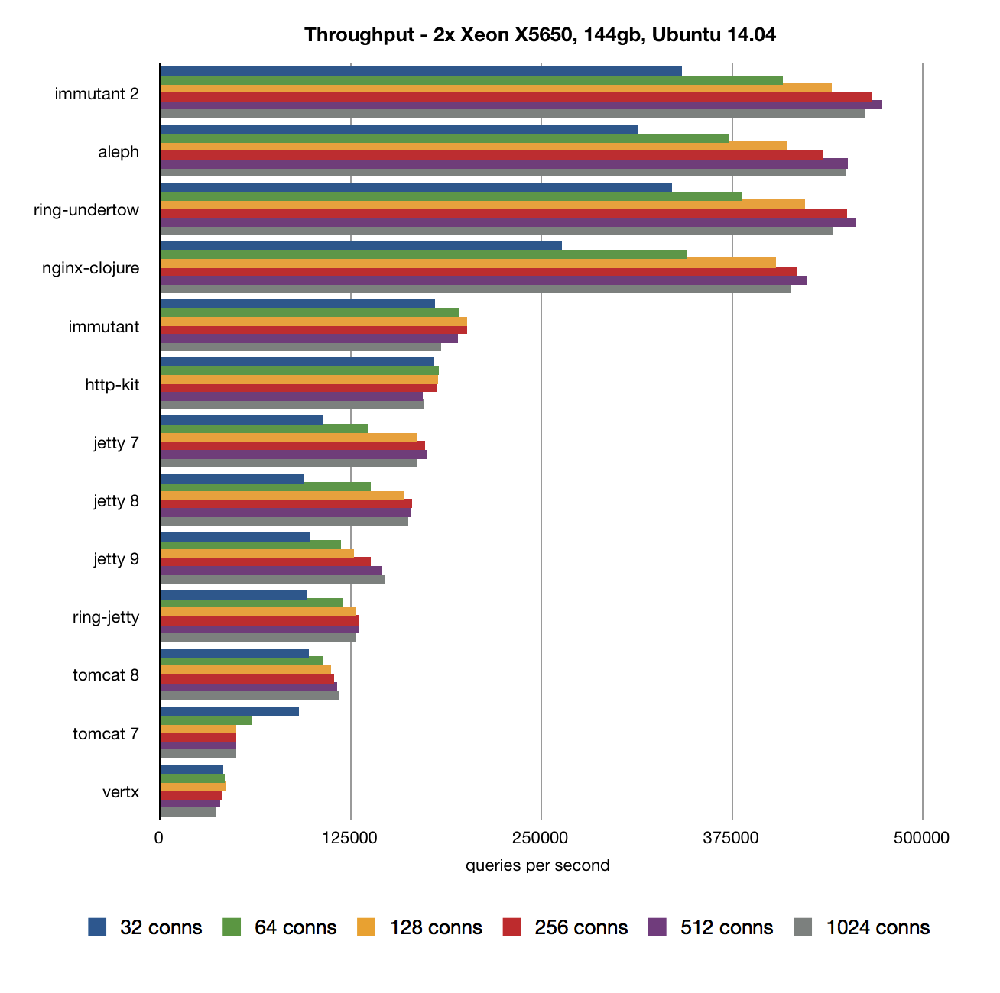

# Clojure web server shoot-out

This is a **collaborative repo**. Please see [here](#contact--contribution) for info on contributors & contributing.

## Latest Results

### 2015 Feb 30

  * **Processor**: 2x 2.10GHz Xeon [E5-2620 v2](http://ark.intel.com/products/75789/Intel-Xeon-Processor-E5-2620-v2-15M-Cache-2_10-GHz) (total 24 hardware threads).
  * **Memory**: 128GB.
  * **OS**: CentOS 7.
  * **Clojure**: 1.7.0-alpha2 on Oracle JDK7.
  * **Tool** : wrk2
  * **TODO** : use wrk [patch](https://github.com/wg/wrk/issues/118#issuecomment-72155351) to fix jetty errors when under non-keepalive benchmark 
  * Raw data (incl. latencies)
    +  [32~1024 keepalived connections](results/20150129-01-40)
    +  [32~1024 non-keepalived connections](results/20150129-03-55-nonkeepalive)
    +  [10000 ~ 60000  keepalived connections] (results/20150129-06-24-largeNumofConns)

+ 32~1024 connections
     + keepAlive on [(text table)](results/20150129-01-40-table.txt) 
       * [throughput chart](results/20150129-01-40-qps.png)
       * [errors chart](results/20150129-01-40-errs.png)
       * [mean latency chart](results/20150129-01-40-mlat.png) 
       * [99.99% latency chart](results/20150129-01-40-n4lat.png)
     + keepAlive off  [(text table)](results/20150129-03-55-nonkeepalive-table.txt)
       * [throughput chart](results/20150129-03-55-nonkeepalive-qps.png)
       * [errors chart](results/20150129-03-55-nonkeepalive-errs.png)
       * [mean latency chart](results/20150129-03-55-nonkeepalive-mlat.png) 
       * [99.99% latency chart](results/20150129-03-55-nonkeepalive-n4lat.png)
+ 10000 ~ 60000 connections
     + keepAlive on [ (text table)](results/20150129-06-24-largeNumofConns-table.txt) 
       * [throughput chart](results/20150129-06-24-largeNumofConns-qps.png)
       * [errors chart](results/20150129-06-24-largeNumofConns-errs.png)
       * [mean latency chart](results/20150129-06-24-largeNumofConns-mlat.png) 
       * [99.99% latency chart](results/20150129-06-24-largeNumofConns-n4lat.png)

### 2014 Nov 6

  * **Processor**: 2x 2.66GHz Xeon [X5650](http://ark.intel.com/products/47922/Intel-Xeon-Processor-X5650-12M-Cache-2_66-GHz-6_40-GTs-Intel-QPI) (total 24 hardware threads).
  * **Memory**: 144GB.
  * **OS**: Ubuntu 14.04.
  * **Clojure**: 1.7.0-alpha2 on Oracle JDK7.
  * **Tool** : wrk
  * Raw data (incl. latencies) available [here](results/20141106-13-28).

  

### 2014 May 3

  * **Processor**: 1x 2.9GHz Intel Core [i7-3520M](http://ark.intel.com/products/64893/Intel-Core-i7-3520M-Processor-4M-Cache-up-to-3_60-GHz) (total 4 hardware threads).
  * **Memory**: 16GB 1600MHz DDR3.
  * **OS**: Fedora 19.
  * **Clojure**: 1.5.1 on OpenJDK 1.7.0-51.
  * **Tool** : Apache ab
  * Raw data available [here](http://goo.gl/2FtAFy).

  

### 2014 Feb 21

  * **Processor**: 1x 2.4GHz Intel Core [i7-4700MQ](http://ark.intel.com/products/75117/Intel-Core-i7-4700MQ-Processor-6M-Cache-up-to-3_40-GHz) (total 8 hardware threads).
  * **Memory**: 16GB 1333MHz DDR3.
  * **OS**: Ubuntu 13.04.
  * **Clojure**: 1.5.1 on Oracle JDK7 build  1.7.0_45.
  * **Tool** :  Apache ab
  * Raw data available [here](http://goo.gl/XrHk7C).

  

## Configuration

  * Response length: 1163 bytes (`servers/index.html`).
  * 32~1024 connections
     + keepAlive on  
          + `scripts/run-servers.sh`.
          + `wrk2  -t 16 -c <32, 64, 128, 256, 512, 1024> -R 400000  -d 60s`.
     + keepAlive off 
          + `scripts/run-servers-for-largeNumofConns.sh`.
          +  `wrk2  -H 'Connection: Close' -t 16 -c <32, 64, 128, 256, 512, 1024> -R 400000  -d 60s`.
  * 10000 ~ 60000 connections
     + `scripts/run-servers-for-largeNumofConns.sh`.
     +  `wrk2  -t 16 -c <10000, 20000, 40000, 60000> -R 200000  -d 60s`.
  * Leiningen `trampoline`, `:jvm-opts ["-server"]`.
  * See `scripts/tune_linux.sh` , `scripts/tune_macosx.sh`  for details about OS tuning. Please run the related tune_xxx.sh before starting servers or ab.
  * See `scripts/bench*.sh` for full details.
  * See `scripts/strip-results.sh` for full details about  generating stripped results
  * See `utils/results-parser/src/wrk2_result_parser.clj` for full details about generating text table and charts from stripped results.
     + we can use `lein run path-to-stripped-result 'some info, e.g. date, hardware, connections, etc.'` to generate text table and charts.
  * **Detailed benchmark results** available in `/results/`.
  * **Clojure Google Group discussion**: http://goo.gl/xe46R.

## Servers

  * [Jetty Ring adapter](https://github.com/ring-clojure/ring) - Standard Ring adapter.
  * [http-kit](https://github.com/shenfeng/http-kit) - HTTP client/server with async & WebSockets support.
  * [Aleph](https://github.com/ztellman/aleph) - Clojure framework for asynchronous communication, built on top of Netty and Manifold.
  * Jetty 7/8/9, Tomcat 7/8 servlets via [lein-servlet](https://github.com/kumarshantanu/lein-servlet).
  * [nginx 1.4.4](http://nginx.org) + [php5-fpm 5.5.3+dfsg-1ubuntu2.1](http://php-fpm.org/)
  * [nginx-clojure 0.2.6](https://github.com/xfeep/nginx-clojure) compiled into [nginx 1.4.4](http://nginx.org)  .
  * [Immutant 1.1.1](http://immutant.org/)
  * [Immutant 2 "thedeuce"](https://github.com/immutant/immutant)
  * [Undertow Ring adapter 0.2.1](https://github.com/piranha/ring-undertow-adapter)

## Contact & contribution

This is a **collaborative repo** maintained by [a number of contributors](https://github.com/ptaoussanis/clojure-web-server-benchmarks/graphs/contributors). Thanks to everyone for making this possible!

### Welcoming *pull requests* for:
  * Additional web servers.
  * Updated servers (no snapshot releases please).
  * Server / bench config tuning!

### If you are submitting a pull request to update results

  1. Please try to **include graph/s** when possible. We're looking primarily at relative numbers here so it's not a big deal if the hardware changes between PRs, so long as it's documented and mentioned in any graphs.
  2. Please try ensure that **all** servers being benchmarked have a **reasonable configuration for your hardware environment**. This is especially important if your hardware environment is unusual (e.g. fewer/more cores than usual). If you're unclear on how to adjust some server's configuration for your environment, feel free to open an issue to check that the config you're proposing seems solid to interested maintainers.

You can reach me (Peter Taoussanis) at [taoensso.com](https://www.taoensso.com), or the other contributors through the [issues page](https://github.com/ptaoussanis/clojure-web-server-benchmarks/issues?state=open).
