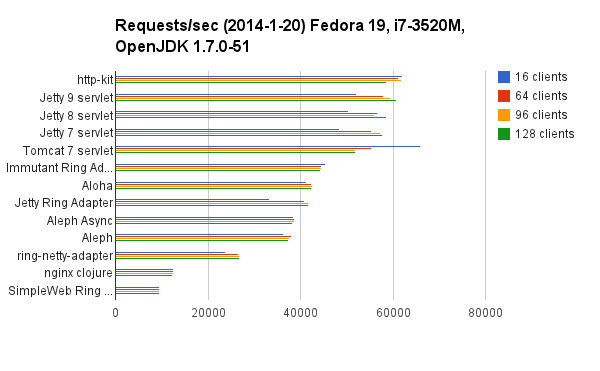

# Clojure web server shoot-out

## Results

###From xfeep

  * **Clojure Google Group discussion**: http://goo.gl/xe46R.
  * **Detailed benchmark results** available in `/results/`.
  * Chart available on [Google Drive](http://goo.gl/cIEmev).
  * **Margin of error**: +/- ~10%.

###From jcrossley3

  * **Clojure Google Group discussion**: http://goo.gl/xe46R.
  * **Detailed benchmark results** available in `/results/`.
  * Chart available on [Google Drive](http://goo.gl/2FtAFy).
  * **Margin of error**: +/- ~10%.
  * something about nginx-clojure maybe was misconfigured.

### Pending changes
  * None

### Update History

#### 2014-01-20

  * add immutant testing (latest official release 1.0.2)

#### 2014-01-14

  * org.clojure/clojure 1.4.0 --> 1.5.1
  * compojure    1.1.4        --> 1.1.6
  * ring         1.1.6        --> 1.2.1
  * aleph        0.3.0-beta13 --> 0.3.0
  * http-kit     1.3.0-alpha2 --> 2.1.16
  * ring-netty-adapter 0.0.3 -->  netty-ring-adapter 0.4.6
  * remove testing about pure nginx which generally dosen't service dymanic contents without other modules. 
  * add nginx with php5-fpm 5.5 testing
  * add nginx-clojure 0.1.0 testing
  * add 128 clients testing

## Configuration
  * 2.4GHz Intel Core i7 with 16GB 1333MHz DDR3, running Ubuntu 13.10.
  * Clojure 1.5.1 on Oracle JDK7 build build 1.7.0_45.
  * Response length: 1163 bytes (`servers/index.html`).
  * ApacheBench Version 2.3 Revision: 1430300.
  * ApacheBench `ab -n 300000 -c <16,64,92,128> -rk`.
  * Leiningen `trampoline`, `:jvm-opts ["-server" "-XX:+UseConcMarkSweepGC"]`.
  * See `scripts/tune_linux.sh` , `scripts/tune_macosx.sh`  for details about OS tuning. Please run the related tune_xxx.sh before starting servers or ab.
  * See `scripts/bench.sh` for full details.
  * See `servers/nginx-php/conf/nginx.conf` for nginx php config. **TODO**: Improve. Suggestions?
  * **TODO**: Higher concurrency testing: c=256, c=500, c=1000.

## Servers
  * [Jetty Ring adapter](https://github.com/ring-clojure/ring) - Standard Ring adapter.
  * [SimpleWeb Ring adapter](https://github.com/netmelody/ring-simpleweb-adapter) - Pure-Java HTTP server without using Servlets.
  * [Netty Ring adapter](https://github.com/shenfeng/async-ring-adapter) - Netty adapter for use with Ring.
  * [http-kit](https://github.com/shenfeng/http-kit) - HTTP client/server with async & WebSockets support.
  * [Aleph](https://github.com/ztellman/aleph) - Clojure framework for asynchronous communication, built on top of Netty and Lamina.
  * [Aloha](https://github.com/ztellman/aloha) - Reference implementation of a Clojure/Netty webserver, or basically Aleph without any extraneous fluff.
  * Jetty 7, Jetty 8, Tomcat 7 servlets via [lein-servlet](https://github.com/kumarshantanu/lein-servlet).
  * [nginx 1.4.4](http://nginx.org) + [php5-fpm 5.5.3+dfsg-1ubuntu2.1](http://php-fpm.org/)
  * [nginx-clojure 0.1.0](https://github.com/xfeep/nginx-clojure) compiled into [nginx 1.4.4](http://nginx.org)  .
  * **TODO**: Containers (Jetty, Tomcat, GlassFish), Webbit. More ideas welcome!

## Contact & contribution

### Welcoming pull-requests for:
  * More servers.
  * Updated servers (no snapshot releases please!).
  * Server / bench config tuning!

Reach me (Peter Taoussanis) at [taoensso.com](https://www.taoensso.com) for questions/comments/suggestions/whatever. I'm very open to ideas if you have any! I'm also on Twitter: [@ptaoussanis](https://twitter.com/#!/ptaoussanis).
