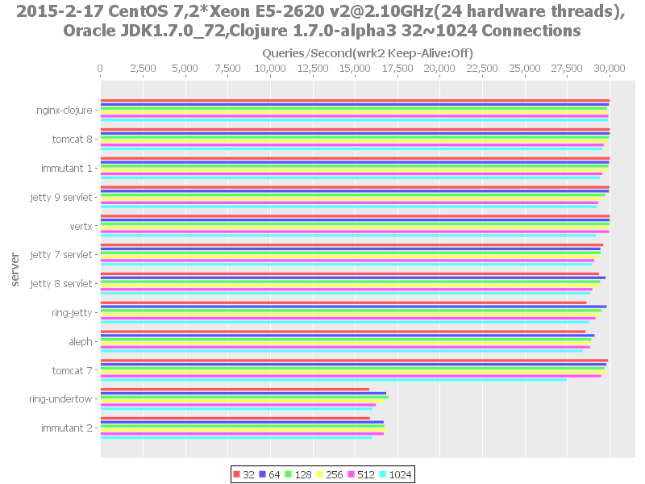

# 1k-non-keepalive

> 32→1024 conns (**non**-keepalive).
>
> No comments for this benching profile.

## Results (newest → oldest)

### xfeep.2015.02.17

> http-kit excluded from these non-keepalive results due to [#27](http://goo.gl/MDJAaZ).

Detail                  | Value
----------------------- | -----
Submitter               | [@xfeep][]
Processor               | 2x 2.10GHz Xeon [E5-2620 v2][] (total **24** hardware threads)
Memory                  | 128GB
OS                      | CentOS 7
Clojure                 | 1.7.0-alpha2 on Oracle JDK7
Tool                    | [wrk2][] with [patch][]
**Text results (raw)**  | [here](20150217-11-17)
Text results (table)    | [here](20150217-11-17-table.txt)

###### xfeep.2015.02.17 - Throughput

###### xfeep.2015.02.17 - Errors

[@xfeep]: https://github.com/xfeep
[wrk2]: https://github.com/giltene/wrk2
[patch]: https://github.com/wg/wrk/issues/118#issuecomment-72155351
[E5-2620 v2]: http://ark.intel.com/products/75789/Intel-Xeon-Processor-E5-2620-v2-15M-Cache-2_10-GHz