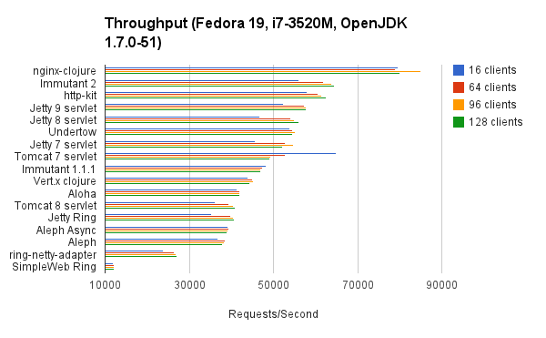
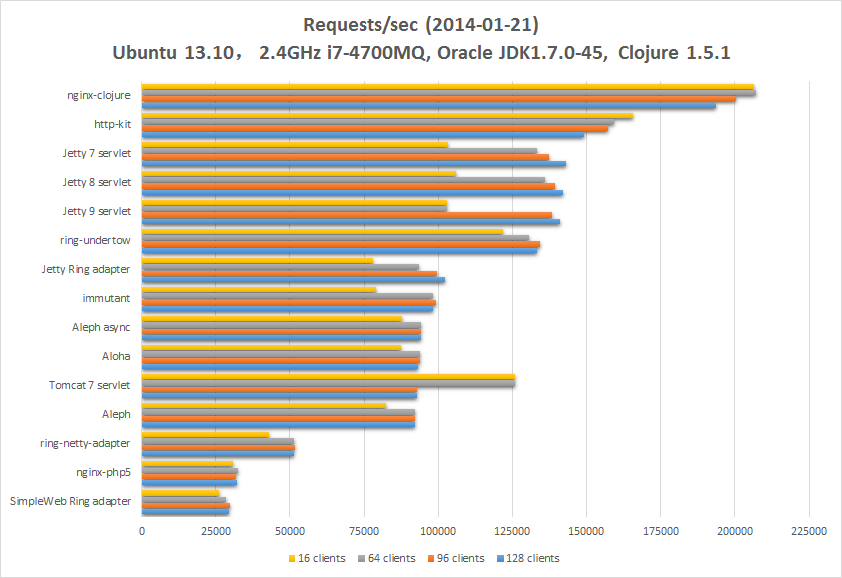

# Legacy results

> These results were taken before we introduced the notion of named benchmarking profiles. **Bench tools + config may vary**.

## 2014 Nov 6

  * **Processor**: 2x 2.66GHz Xeon [X5650](http://ark.intel.com/products/47922/Intel-Xeon-Processor-X5650-12M-Cache-2_66-GHz-6_40-GTs-Intel-QPI) (total **24** hardware threads).
  * **Memory**: 144GB.
  * **OS**: Ubuntu 14.04.
  * **Clojure**: 1.7.0-alpha2 on Oracle JDK7.
  * Raw data (incl. latencies) available [here](20141106-13-28).

  

## 2014 May 3

  * **Processor**: 1x 2.9GHz Intel Core [i7-3520M](http://ark.intel.com/products/64893/Intel-Core-i7-3520M-Processor-4M-Cache-up-to-3_60-GHz) (total 4 hardware threads).
  * **Memory**: 16GB 1600MHz DDR3.
  * **OS**: Fedora 19.
  * **Clojure**: 1.5.1 on OpenJDK 1.7.0-51.
  * Raw data available [here](20140503-01-04).

  

## 2014 Feb 21

  * **Processor**: 1x 2.4GHz Intel Core [i7-4700MQ](http://ark.intel.com/products/75117/Intel-Core-i7-4700MQ-Processor-6M-Cache-up-to-3_40-GHz) (total 8 hardware threads).
  * **Memory**: 16GB 1333MHz DDR3.
  * **OS**: Ubuntu 13.04.
  * **Clojure**: 1.5.1 on Oracle JDK7 build  1.7.0_45.
  * Raw data available [here](20140121-14-30).

  